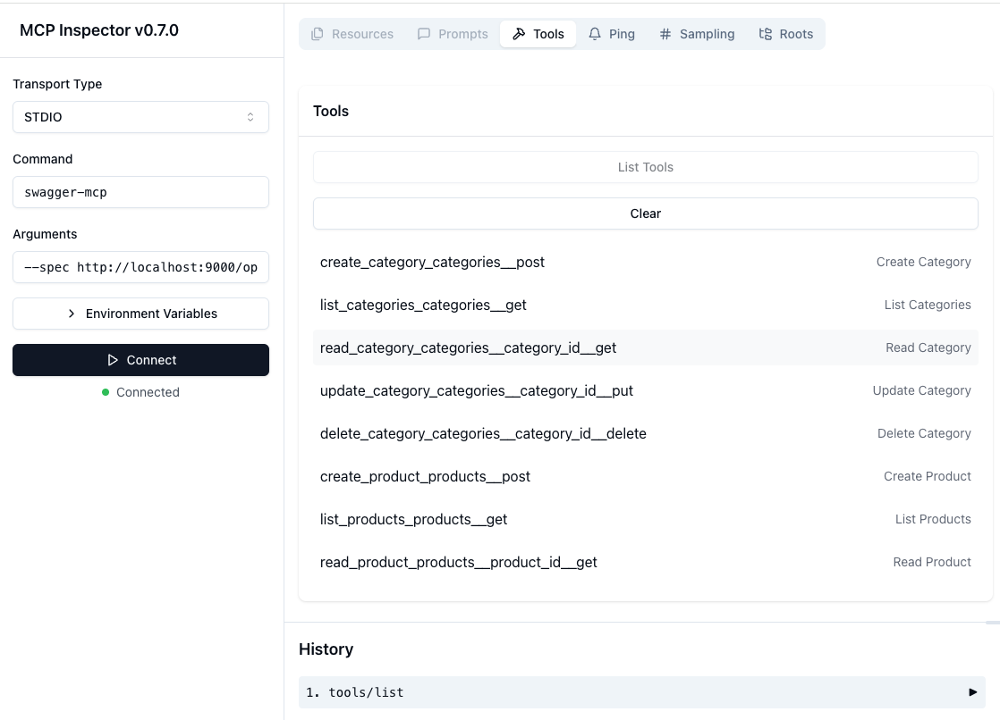

```
   _____                                    __  __  _____ _____  
  / ____|                                  |  \/  |/ ____|  __ \ 
 | (_____      ____ _  __ _  __ _  ___ _ __| \  / | |    | |__) |
  \___ \ \ /\ / / _` |/ _` |/ _` |/ _ \ '__| |\/| | |    |  ___/ 
  ____) \ V  V / (_| | (_| | (_| |  __/ |  | |  | | |____| |     
 |_____/ \_/\_/ \__,_|\__, |\__, |\___|_|  |_|  |_|\_____|_|     
                       __/ | __/ |                               
                      |___/ |___/                                
```

Automatically convert any Swagger/OpenAPI specification into an MCP server for use with Windsurf, Cursor, and other AI tools. This package enables AI agents to interact with your API endpoints through natural language, making API integration seamless and intuitive.

## Quickstart

Install using pipx (recommended):
```bash
pipx install swagger-mcp
```

Or install from source:
```bash
bash scripts/install-global.sh
```

Confirm the installation succeeded:
```bash
which swagger-mcp
which swagger-mcp-sample-server
```

Spin up a sample "products and product categories" API on your local machine on port 9000:
```bash
swagger-mcp-sample-server
```

Visit [http://localhost:9000/docs](http://localhost:9000/docs) to confirm the sample server is running.


### Cursor
Configure an MCP server in Cursor (Top Right Settings -> MCP -> Add New MCP Server -> Command Server):
```bash
swagger-mcp --spec http://localhost:9000/openapi.json --name "Product MCP" --server-url http://localhost:9000
```

**Please Note**: *In Cursor, you may need to replace `swagger-mcp` with the full path to the `swagger-mcp` executable, which you can find by running `which swagger-mcp`.*

### Windsurf
Start an MCP Server in Windsurf (Windsurf Settings -> Settings -> Windsurf Settings -> Cascade -> Add Server -> Add Custom Server):
```json
    "product-mcp": {
      "command": "swagger-mcp",
      "args": [
        "--spec",
        "http://localhost:9000/openapi.json",
        "--name",
        "Product MCP",
        "--server-url",
        "http://localhost:9000"
      ] 
    }
``` 

### Claude
Edit `~/Library/Application\ Support/Claude/claude_desktop_config.json`:

```json
{
    "mcpServers": {
        "product-mcp": {
            "command": "swagger-mcp",
            "args": [
                "--spec",
                "http://localhost:9000/openapi.json",
                "--name",
                "Product MCP",
                "--server-url",
                "http://localhost:9000"
            ]
        }
    }
}
```

That's it! Your API is now accessible through Windsurf, Cursor, or Claude as a set of AI-friendly tools.

Ask your AI agent to list, create, update, and delete products and categories.

## Additional Options

1. You can pass a JSON file, YAML file, or URL for the `--spec` option:
    * /path/to/openapi.json
    * /path/to/openapi.yaml
    * https://api.example.com/openapi.json

2. Filter endpoints: Only include endpoints by path:
This will regex search the endpoint paths and only include those that match the pattern.
```bash
swagger-mcp --spec http://localhost:9000/openapi.json --name "Product MCP" --server-url http://localhost:9000 --include-pattern "category"
```

3. Filter endpoints: Exclude endpoints by path:
This will exclude any endpoints that match the regex pattern.
```bash
swagger-mcp --spec http://localhost:9000/openapi.json --name "Product MCP" --server-url http://localhost:9000 --exclude-pattern "product"
```

4. Authentication
```bash
swagger-mcp --spec http://localhost:9000/openapi.json --name "Product MCP" --server-url http://localhost:9000 --bearer-token "your-token-here"
```

5. Custom headers
```bash
swagger-mcp --spec http://localhost:9000/openapi.json --name "Product MCP" --server-url http://localhost:9000 --additional-headers '{"X-API-Key": "your-key"}'
```

6. Server URLs
If the OpenAPI spec already contains a specific server URL, you don't have to provide it as a command line argument.  The command line argument overrides all endpoints.

## Supported Features
- All HTTP methods (GET, POST, PUT, DELETE, etc.)
- Path parameters
- Query parameters
- Textual Multi-Part Request Body Fields
- JSON Request body
- Bearer Token Authentication

## Limitations

- If you find a Swagger API specification that is not supported, please file an issue. We will add support for it as needed / requested.
- We do not support Swagger/OpenAPI specifications spread across multiple files (i.e.; fragments, extensions, etc.).
- We do not support path variable substitution in the base server URLs (but we *do* support path variable in the endpoint paths).
- We do not support automatic OAuth workflow execution.  If the OAuth workflow ends in a bearer token, you must provide this bearer token as a command line argument.
- In general, we do not support all Swagger/OpenAPI features.  The Swagger/OpenAPI standard is vast, and support for more obscure features will be added as needed / requested.
- All endpoints are exposed as tools.  When Cursor re-implements support for MCP resources, Swagger MCP will support resources as well.

## Command Line Options

- `--spec` (required): Path or URL to your OpenAPI/Swagger specification
- `--name` (required): Name for your MCP server (shows up in Windsurf/Cursor)
- `--server-url`: Base URL for API calls (overrides servers defined in spec)
- `--bearer-token`: Bearer token for authenticated requests
- `--additional-headers`: JSON string of additional headers to include in all requests
- `--include-pattern`: Regex pattern to include only specific endpoint paths (e.g., "/api/v1/.*")
- `--exclude-pattern`: Regex pattern to exclude specific endpoint paths (e.g., "/internal/.*")

## Authentication

For APIs requiring authentication:

```bash
# Using bearer token
swagger-mcp --spec http://localhost:9000/openapi.json --name "Product MCP" --bearer-token "your-token-here"

# Using custom headers
swagger-mcp --spec http://localhost:9000/openapi.json --name "Product MCP" --additional-headers '{"X-API-Key": "your-key"}'
```

## For Developers

### Installation

For development, install with development dependencies:
```bash
# Clone the repository
git clone https://github.com/context-labs/swagger-mcp.git
cd swagger-mcp

# Install in development mode with dev dependencies
pip install -e ".[dev]"
```

For a global installation on your local machine, use:
```bash
bash scripts/install-global.sh
```

### Unit Tests

```bash
pytest swagger_mcp/tests/unit -v
```

### Integration Tests

```bash
pytest swagger_mcp/tests/integration -v --capture=no --log-cli-level=INFO
```

### MCP Inspector (For interactive exploration of the MCP Server)

You'll have to do a global installation of your latest code first (`bash scripts/install-global.sh`), then you can run the inspector script.

You'll see the server type `STDIO` and the command `swagger-mcp` pre-filled.

```bash
bash scripts/inspector.sh
```

Click "Connect" and then "List Tools" to begin interacting with your MCP Server.


